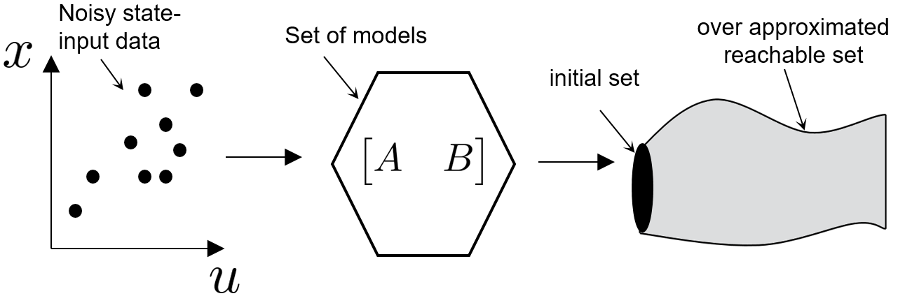

## Data Driven Reachability Analysis using Matrix Zonotopes
  
We consider the problem of computing the set of states that a system can reach,  
which is commonly known as reachability analysis. This repo cotains the code for our paper:  
[1] Amr Alanwar, Anne Koch, Frank Allgöwer, Karl Johansson "Data Driven Reachability Analysis from Noisy Data with Unknown
 System Model  

We consider the problem of reachability analysis from noisy data given that the system 
model is unknown. Identifying a model is a preliminary step in the state of the art 
reachability analysis approaches. However, systems are becoming more complex and data 
is becoming more readily available. 

   

## Running 
Add CORA toolbox to your path 
run t_linearDT.m for linear system 
run t_nonlinearDT.m for nonlinear system 