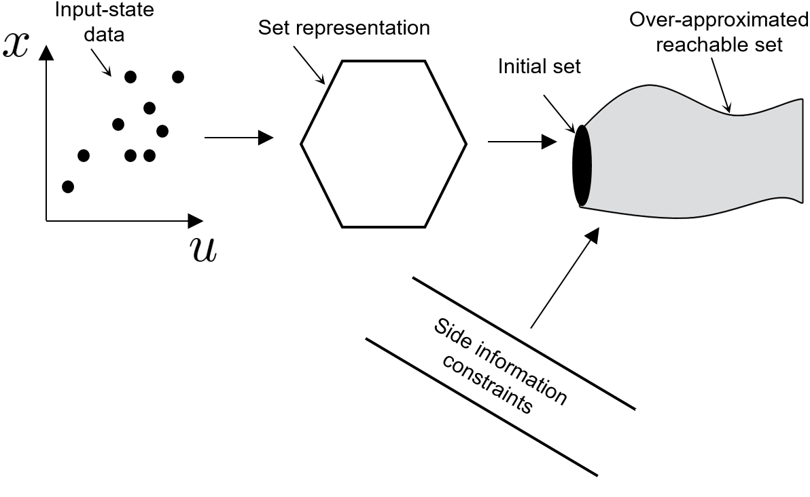

## Data Driven Reachability Analysis from Noisy Data
<br /> 
This repo cotains the code for our two papers:<br /> <br />
[1] Amr Alanwar, Anne Koch, Frank Allgöwer, Karl Johansson "Data Driven Reachability Analysis Using Matrix Zonotopes"   
3rd Annual Learning for Dynamics & Control Conference <br />
https://arxiv.org/pdf/2011.08472 <br /><br />

<br /><br />
[2] Amr Alanwar, Anne Koch, Frank Allgöwer, Karl Johansson "Data Driven Reachability Analysis from Noisy Data" Submitted to IEEE Transactions on Automatic Control<br />
https://arxiv.org/abs/2105.07229/<br /><br />
 
## Problem Statement
We consider the problem of reachability analysis from noisy data, given that the system model is unknown. 
Identifying a model is a preliminary step in the state-of-the-art reachability analysis approaches. 
However, systems are becoming more complex, and data is becoming more readily available. 
We propose a data-driven reachability analysis using matrix zonotope and using a new set representation named constrained matrix zonotope.<br />
The following figure summarizes the idea behind our papers.
<br /> <br />
<p align="center">

</p>
<br />
<br />

## Files Description 
There are two levels of complexity for the proposed data driven reachability analysis<br />
A- Basic reachability analysis under the folder examples-basic<br /><br />
B- Advanced reachability analysis using constrained matrix zonotope under the folder examples-cmz.
These files compare three methods for reachability analysis namely, matrix zonotope, constrained matrix
zonotop using exact noise description and constrained matrix zonotope given side information.<br />
<br />

## Running 
1- Download [CORA](https://github.com/TUMcps/CORA) and [MPT](https://www.mpt3.org) toolboxs.<br />
2- Add CORA nad MPT folder and subfolders to the Matlab path.  <br />
3- Add the repo folder and subfolders to the Matlab path.  <br />
<br />
<br />
## Basix reachablity under the folder examples-basic:<br />
1- run a_linearDT.m for linear system using matrix zonotope.<br />
2- run a_nonlinearDT.m for nonlinear system.<br />
3- run a_polyDT.m for polynomial system using matrix zonotope.<br />
<br />
<br />
## Advanced reachablity under the folder examples-cmz:<br />
1- run b_linearDT_measnoise.m for linear system with measurement noise.<br />
2- run b_linearDT_sideInfo.m for linear system given side information.<br />
3- run b_polyDT_sideInfo.m for polynomial system given side information.<br />
<br />
<br />
You can save the workspace after any advanced reachability file (folder examples-cmz) and then run the plotting 
file under the folder plotting.<br />
For example, run<br />
b_linearDT_sideInfo.m<br />
save the workspace and load it later then run<br />
p_plot_linearDT_sideInfo.m<br />
<br />
<br />
<br />
<br />
<br />
Our papers Bibtex are as follow:<br />
```
@article{datadriven_reach1,
  title={Data-Driven Reachability Analysis Using Matrix Zonotopes},
  author={Alanwar, Amr and Koch, Anne and Allgöwer, Frank and Johansson, Karl Henrik},
  journal={arXiv preprint arXiv:2011.08472},
  year={2020}
}
```

```
@article{datadriven_reach2,
  title={Data-Driven Reachability Analysis from Noisy Data},
  author={Alanwar, Amr and Koch, Anne and Allgöwer, Frank and Johansson, Karl Henrik},
  journal={arXiv preprint arXiv:2105.07229},
  year={2021}
}
```
